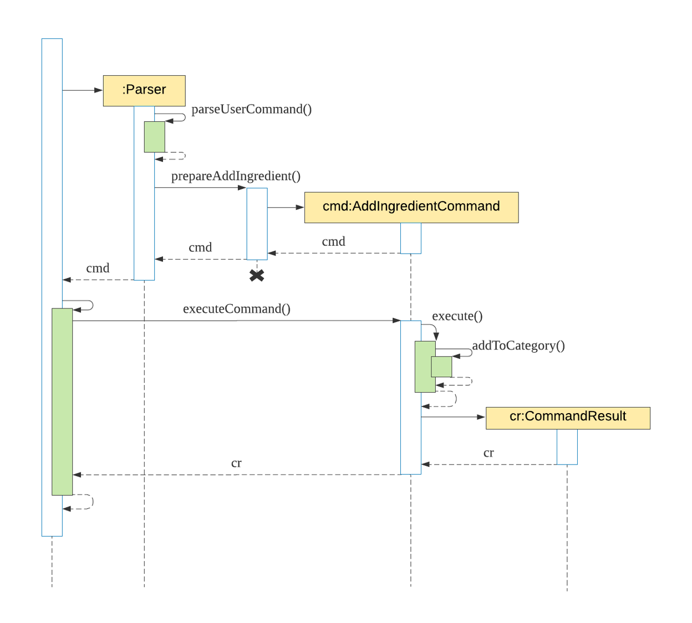
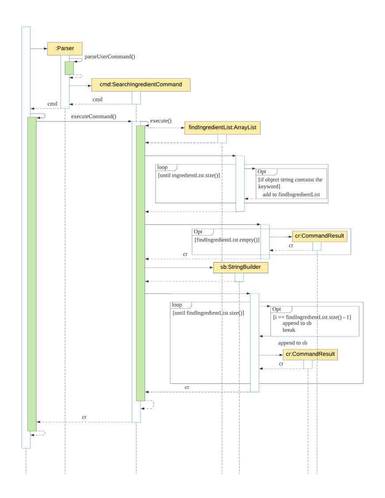
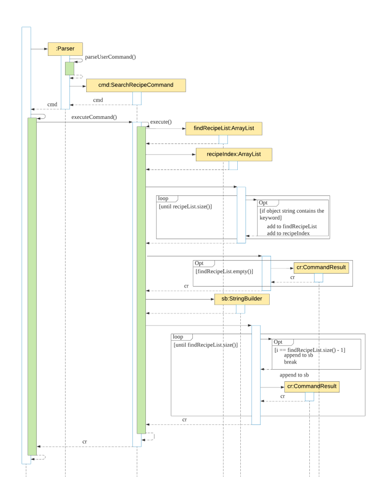
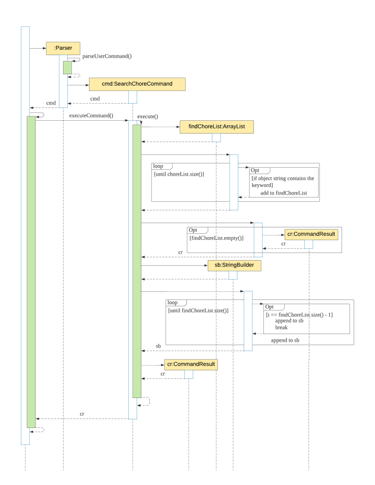

# Developer Guide
By: `CS2113T-M16-2` Since: `2020`

  
- [Developer Guide](#developer-guide)
  * [1. Introduction](#1-introduction)
    + [1.1. Purpose](#11-purpose)
    + [1.2. Scope](#12-scope)
  * [2. Setting up](#2-setting-up)
  * [3. Design](#3-design)
  * [4. Implementation](#4-implementation)
    + [4.1.Ingredient-related Features](#41ingredient-related-features)
      - [4.1.1. Addition of ingredient](#411-addition-of-ingredient)
      - [4.1.2. List all/ specific ingredient(s)](#412-list-all-specific-ingredients)
      - [4.1.3. Delete all/ specific ingredients(s)](#413-delete-all-specific-ingredientss)
      - [4.1.4. Search for ingredients based on keyword(s)](#414-search-for-ingredients-based-on-keywords)
    + [4.2. Recipe-related Features](#42-recipe-related-features)
      - [4.2.1. Addition of recipe](#421-addition-of-recipe)
      - [4.2.2. List all/ specific recipe(s)](#422-list-all-specific-recipes)
      - [4.2.3. Delete all/ specific recipe(s)](#423-delete-all-specific-recipes)
      - [4.2.4. Search for recipe based on keyword(s)](#424-search-for-recipe-based-on-keywords)
    + [4.3. Chore-related Features](#43-chore-related-features)
      - [4.3.1. Addition of chore](#431-addition-of-chore)
      - [4.3.2. List all/ specific chore(s)](#432-list-all-specific-chores)
      - [4.3.3. Delete all/ specific chore(s)](#433-delete-all-specific-chores)
      - [4.3.4. Search for chore based on keyword(s)](#434-search-for-chore-based-on-keywords)
    + [4.4. Storage](#44-storage)
      - [4.4.1. Select files to load from and save to](#441-selection-of-load-files)
      - [4.4.2. Save current state](#442-save-current-state)
    + [4.5. Logging](#45-logging)
    + [4.6. Configuration](#46-configuration)
  * [Appendices](#appendices)
    + [Appendix A: Product Scope](#appendix-a-product-scope)
    + [Appendix B: User Stories](#appendix-b-user-stories)
    + [Appendix C: Value proposition - Use cases](#appendix-c-value-proposition---use-cases)
    + [Appendix D: Non-Functional Requirements](#appendix-d-non-functional-requirements)
    + [Appendix E: Glossary](#appendix-e-glossary)
    + [Appendix G: Instructions for Manual Testing](#appendix-g-instructions-for-manual-testing)
      - [G.1. Launch and Shutdown](#g1-launch-and-shutdown)
      - [G.2. Deleting a](#g2-deleting-a)
      - [G.3. Saving data](#g3-saving-data)

## 1. Introduction
### 1.1. Purpose
### 1.2. Scope

## 2. Setting up

## 3. Design

### 3.1. Architecture
### 3.2. Ui Component


API: `Ui.java`
 
The `Ui` component is a singleton class where all interaction will be made through this component
 
The `Ui` component,

* Executes user commands using the command component
* Listens for changes and outputs messages from the Command component

### 3.3. Logic Component
### 3.4. Model Component
### 3.5. Storage Component
### 3.6. Common Classes 
Classes used by multiple components are in the `seedu.kitchenhelper.object` package.

## 4. Implementation
This section describes some details on how the features are being implemented. All recipe/ ingredient/ chore-related features can be broken down into 4 distinct functionality, addition, listing, deletion and searching.

### 4.1.Ingredient-related Features
#### 4.1.1. Addition of ingredient

The addition of the ingredient feature allows the user to keep track of the ingredients in the ingredient’s list.   
For example, `addingredient /n beef /c meat /q 2 /p 20 /e 18/02/2020` will add the ingredient `beef` 
which have the following attributes:  category `meat`, quantity `2`, price `$20` and expiry `18/02/2020`  

##### Implementation

 

The following steps explained “Sequence diagram for an example `addingredient` command”:  
1. The user enters `addingredient /n beef /c meat /q 2 /p 20 /e 18/02/2020`.  
2. `KitchenHelper` calls `Parser#parseUserCommand()`.  
3. `Parser#parseUserCommand()` will call its own method `Parser#prepareAddIngredient()`.  
4. `Parser#prepareAddIngredient()` will first validate the attributes and create an object `AddIngredientCommand` with the attributes if successful.  
5. `KitchenHelper` calls it own method `executeCommand()` to execute the method in `AddIngredientCommand#execute()`.  
6. On `AddIngredientCommand#execute()`, ingredient is added and return of the message.  

#### 4.1.2. List all/ specific ingredient(s)

The listing of Ingredients feature shows the user the existing data that is added by the user. The user is also able to specify which category would they want to display.
Command usage: `listingredient all` will show the details of all ingredients
which have the following attributes:  category `all`

#### 4.1.2.1. Implementation
{insert sequence diagram}
Steps for `listingredient all` command:
1. The user enters  `listingredient all`.  
2. `KitchenHelper` calls `Parser#parseUserCommand()` which splits the user’s input into 2 parts 
and enters a switch case for execution.  
3. `parseUserCommand` in the Parser object will call its own method `Parser#prepareListIngredient`.  
4. `prepareListIngredient` will first validate if the user's input is belongs to `all/dairy/drink/fruit/meat/miscellaneous/staple/vegetable`, 
following, it will return the items belonging into the category, 
otherwise it will throw an `InvalidCommand` along with the syntax of `listingredient command`  
5. On execute(), the ingredient in the list will be printed out.
#### 4.1.3. Delete all/ specific ingredients(s)
The deletion feature for ingredients allows the user to delete ingredients either by the name or index of the ingredients. In addition to that, it allows users to reduce the quantity of a specific ingredient. 

<b>Implementation</b><br>
When the user attempts to reduce the quantity of ingredient at index 1 of the ingredients inventory by 4,  the `Kitchen Helper`, ‘Parser’ and ‘DeleteRecipeCommand` class will be called upon. The following sequence of steps will then occur: 
1. The user keyed in “deleteingredient /i 1 /q 4”`. 
    2. A `UI` object will be created and it will call `UI#getUserCommand()` method to take in the input that the user has keyed in.
    3. A `String` object will be returned and saved into the `userCommandInput` variable in `Kitchen Helper`.
    4. The variable `userCommandInput` is being parsed into the `Parser` class as an argument for this method `Parser#parseUserCommand`.
2. The command inserted by the user is being parsed into the `Parser` and a new `Command` object is being created. 
    2. The variable `userCommandInput` will be identified as `deleteingredient` in the `Parser#parseUserCommand()`.The `Parser#prepareDeleteIngredient()` is being called to prepare the `userCommandInput` string to create a `DeleteIngredientCommand` object.
    3. The `DeleteIngredientCommand` object is created with the ingredientIndex and quantity set to 4. 
3. The Command is now being executed. 
    2. The `DeleteIngredientCommand#execute()` will be called.
    3. As this is a deletion by ingredient index, the `ingredientIndex` variable is not null. As the `ingredientIndex` is not null, `DeleteIngredientCommand#deleteIngredientByIndex()`.
    4. Next, `DeleteIngredientCommand#deleteIngredient()` is called to reduce the quantity of this ingredient since the `quantity` variable is not null. 
    6. Next, `DeleteIngredientCommand#updateNewQuantity()` will be called to update the quantity of this ingredient in our ingredients’ inventory.
    7. Lastly, a String called `feedbackToUser`will be returned to the user to inform the user of the outcome of the command. 
4. The details will then be printed onto the console using `Ui#showResultToUser(result)`.

<b>Design Considerations</b> <br>
Aspect: How is the `DeleteIngredientCommand` initialise. <br>
<br>
Alternative 1 (Current Choice) <br>

|     |     |
|-----|-----|
|**Pros** | This gives us more flexibility on what object can be created with different variables since there are two methods of delete of ingredients. |  
|**Cons** | There is an overload of constructors.|

Alternative 2 <br>

|     |     |
|-----|-----|
|**Pros** |The Parser can call for one main default constructor. |
|**Cons** | The single constructor will need to deal with 2 different methods of deletion, causing the constructor to have more than one purpose.|

#### 4.1.4. Search for ingredients based on keyword(s)

The search for ingredients feature allows the user to find ingredients using a keyword in the ingredient’s list.  
For example, `searchingredient beef` will find all the ingredients that contain `beef`.  

##### Implementation  

 

The following steps explained sequence diagram for `searchingredient` command:  
1. The user enters `searchingredient beef`.  
2. `KitchenHelper` calls `Parser#parseUserCommand()`.  
3. `SearchIngredientCommand` object is created with the keyword passed in.  
4. `KitchenHelper` calls it own method `executeCommand()` to execute the method in `SearchIngredientCommand#execute()`.  
5. On `SearchIngredientCommand#execute()`, display the list of ingredients that matches the keyword. 

##### Design considerations:

Aspects: How `searchingredient` executes:  

- Alternative 1 (current choice): Find if the keyword is part of the substring of the ingredient, 
`[Meat] Beef Qty:3 $20.00 Exp:18/03/2020.`  

|     |     |
|-----|-----|
|**Pros** | 1. Easily to find by any attributes such as category, ingredient’s name,  quantity, price and expiry date.|  
|**Cons** | 1. Searching `beef [meat]` will fail to show any matching result.|

- Alternative 2: Take in all the predicates given by the user and find using the predicates as a keyword

|     |     |
|-----|-----|
|**Pros** | 1. More accurate searching of the ingredient is available for the user.|  
|**Cons** | 1. Requires users to enter more precise predicate keywords which could be more inconvenient.|

### 4.2. Recipe-related Features
#### 4.2.1. Addition of recipe
Users can add a new recipe to the application where there must be at least one or more `ingredient`s. The failure to do so will trigger an exception where the user will be notified of an invalid command and the syntax of the addition of recipe will be displayed. 

> It is important that the name of the new recipe has not appeared in the list of recipes in the application.

When the user attempts to create a new recipe, the `AddRecipeCommand`, ‘Parser’ and `Recipe` class will be accessed and the following sequence of actions are called to create a `recipe` object:

##### 4.2.1.1. Implementation 
When the user attempts to create a new recipe, the `AddRecipeCommand`, ‘Parser’ and `Recipe` class will be accessed and the following sequence of actions are called to create a `recipe` object:

1. User executes `addrecipe /n Chicken Salad /i Chicken Breast:2:meat, Lettuce:4:vegetable` 
    1. A `Ui` object will be created and calls `Ui#getUserCommand()`
    1. Input will be parsed in `Command#parseUserCommand()` and identified with the keyword `addrecipe`.
    
    
2. Parsing of user input and creation of command object
    1. This will automatically trigger the parsing of the user’s input string into a suitable format for the addition of `recipe` object in `Command#prepareAddRecipe()`.
    1. A `AddRecipeCommand` object will be created and calls `AddRecipeCommand#setAttributesOfCmd()` to set the contents of the command into reader friendly formats.
    
    
3. Executing Command
    1. The newly created object will call `#AddRecipeCommand#execute` which starts the process of adding a recipe, thus calling `Recipe#AddRecipe()`.
    1. A `Recipe` object will be created with its name that was parsed in step 2.
    1. An additional step is included where a check for an existing recipe with the same name is conducted with `#AddRecipeCommand#checkIfRecipeExist()`. A `KitchenHelperException` exception will be triggered when there is an existing recipe.
    
    
4. `Ingredient`s parsed in step 2 will be added to the newly created recipe according to their category through the calling of `Recipe#addIngredientsToRecipe()`.
	
	

All description and warnings to the user utilises the `UI` class, which controls the printing of the text on the console. 

The following sequence diagram shows how the `addrecipe` command works

{insert diagram}

##### 4.2.1.2. Design Considerations
Aspect: Parsing of the user’s input command

Alternative 1 (current choice): The key parameters that are required are divided by the delimiter of ‘/’ followed by a specific letter. `(i.e. /i)`

|     |     |
|-----|-----|
|**Pros** | User would be able to have strings that may contain spaces (i.e. /n Chicken Salad /i Breast meat:2:meat) |
|**Cons** | The order of delimiters needs to be standardized, users will not be able to re-order the delimiters. |

Alternative 2: Multiple prompts for user’s input of a recipe name and ingredient(s)

|     |     |
|-----|-----|
|**Pros** | Users would not have to make sure that their command is syntactically right |
|**Cons** | The constant prompting could subject the application to a negative experience in the difficulty to use the commands. |

Alternative 3: User’s command are divided by space

|     |     |
|-----|-----|
|**Pros** | The parsing can be easily done by calling Java built-in function `.split()` |
|**Cons** | Values for each variable cannot contain spaces which makes the application restrictive. |

#### 4.2.2. List all/ specific recipe(s)
The listing of Recipe feature shows the user the existing recipe and it's details that is added by the user.
Command usage: `listrecipe 1` will show the details of recipe number `1`
which have the following attributes:  recipe number `1`

#### 4.1.2.1. Implementation
{insert sequence diagram}
Steps for `listrecipe 1` command:
1. The user enters  `listrecipe 1`.  
2. `KitchenHelper` calls `Parser#parseUserCommand()` which splits the user’s input into 2 parts 
and enters a switch case for execution.  
3. `parseUserCommand` in the Parser object will call its own method `Parser#prepareListRecipe`.  
4. `prepareListIngredient` will first validate if the user's input is a valid integer and if it's more than 0, 
following, it will return the details belonging to the recipe, 
otherwise it will throw an `InvalidCommand` along with the syntax of `listrecipe command`  
5. On execute(), the details in the recipe will be printed out.

#### 4.2.3. Delete all/ specific recipe(s)
The deletion feature for specific recipes allows the user to delete recipes either by the name or index of the recipe. 

<b>Implementation</b> <br>
When the user attempts to delete the `Chicken Rice` recipe from Kitchen Helper, the `Kitchen Helper`, `Parser` and `DeleteRecipeCommand` class will be called upon. The following sequence of steps will then occur: 
1. The user keyed in “deleterecipe /n `Chicken Rice”`.
    2. A `UI` object will be created and it will call `UI#getUserCommand()` method to take in the input that the user has keyed in. 
    3. A `String` object will be returned and saved into the `userCommandInput` variable in `Kitchen Helper`. 
    4. The variable `userCommandInput` is being parsed into the `Parser` class as an argument for this method `Parser#parseUserCommand()`.
2. The command inserted by the user is being parsed into the `Parser` and a new `Command` object is being created. 
    2. The variable `userCommandInput` will be identified as `deleterecipe` in the `Parser#parseUserCommand()`.The `Parser#prepareDeleteRecipe()` is being called to prepare the `userCommandInput` string to create a `DeleteRecipeCommand` object.
3. The command is now being executed.
    2. The `DeleteRecipeCommand#execute()` will be called.
    3. As this is a deletion by recipe name, the `recipeIndex` variable is set as null. As the variable is null, `DeleteRecipeCommand#deleteRecipeByName()` will be called.
    4. Next, the `DeleteRecipeCommand#getRecipeIndex()` to get the index based on the recipe name that the user has inputted. With the given index, `DeleteRecipeCommand#deleteRecipe()` will be called to delete the recipe. 
    5. Lastly, a String called `feedbackToUser`will be returned to the user to inform the user of the outcome of the command. 
4. The details will then be printed onto the console using `Ui#showResultToUser(result)`.


<b>Design Considerations</b> <br>
Aspect: How is the `DeleteRecipeCommand` initialise. <br>
<br>
Alternative 1 (Current Choice): Usage of 2 constructors <br>

|     |     |
|-----|-----|
|**Pros** | This gives us more flexibility on what object can be created with different variables since there are two methods of recipe deletion. |  
|**Cons** | There is an overload of constructors.|

Alternative 2: Usage of 1 constructor <br>

|     |     |
|-----|-----|
|**Pros** |The Parser can call for one main default constructor. |
|**Cons** | The single constructor will need to deal with 2 different methods of deletion, causing the constructor to have more than one purpose.|


#### 4.2.4. Search for recipe based on keyword(s)

The search for recipe feature allows the user to find recipes using a keyword in the recipe’s list.  
For example, `searchrecipe Chicken` will find all recipes that contain `Chicken`.  


##### Implementation



The following steps explained sequence diagram for `searchrecipe` command:  
1. The user enters `searchrecipe Chicken`.  
2. `KitchenHelper` calls `Parser#parseUserCommand()`.  
3. `SearchRecipeCommand` object is created with the keyword passed in.  
4. `KitchenHelper` calls it own method `executeCommand()` to execute the method in `SearchRecipeCommand#execute()`.  
5. On `SearchRecipeCommand#execute()`, display the list of recipe's name that matches the keyword.

##### Design considerations:

Aspects: How `searchrecipe` executes:  

- Alternative 1 (current choice): Find if the keyword is part of the substring of the recipe’s name 
and returns the recipe’s name and the index of recipe in the recipe’s list.  

|     |     |
|-----|-----|
|**Pros** | 1. Easy to find similar recipe by their name.|  
|**Cons** | 1. Only shows the different recipe that contains the keyword.|

- Alternative 2: Find the keyword within the recipe’s ingredient.  

|     |     |
|-----|-----|
|**Pros** | 1. More accurate searching of the recipe that uses the ingredients.|  
|**Cons** | 1. Could be more memory intensive to find if the list is huge.|

### 4.3. Chore-related Features
#### 4.3.1. Addition of chore
#### 4.3.2. List all/ specific chore(s)
#### 4.3.3. Delete all/ specific chore(s)
#### 4.3.4. Search for chore based on keyword(s)

The search for chore feature allows the user to find chores using a keyword in the chore’s list.  
For example, `searchchore groceries` will find all chores that contain `groceries`.  

##### Implementation  



The following steps explained sequence diagram for `searchchore` command:  
1. The user enters `searchchore groceries`.  
2. `KitchenHelper` calls `Parser#parseUserCommand()`.  
3. `SearchChoreCommand` object is created with the keyword passed in.  
4. `KitchenHelper` calls it own method `executeCommand()` to execute the method in `SearchChoreCommand#execute()`.  
5. On `SearchChoreCommand#execute()`, display the list of chore that matches the keyword.

##### Design considerations:

- Alternative 1 (current choice): Find if the keyword is part of the substring of the chore, 
`[x] buy groceries (by: Tuesday 12pm)`.   
 
|     |     |
|-----|-----|
|**Pros** | 1. Easily to find by any attributes such as description and date.|  
|**Cons** | 1. Searching `buy groceries [x]` will fail to show any matching result.|

- Alternative 2: Take in all the predicates given by the user and find using the predicates as a keyword  

|     |     |
|-----|-----|
|**Pros** | 1. More accurate searching of the chore is available for the user..|  
|**Cons** | 1. Requires users to enter more precise predicate keywords which could be more inconvenient.|

### 4.4. Storage
#### 4.4.1. Select files to load from and save to

The select files to load from and save to feature allows the user to choose an option to either load their data from the auto-save mode or the manual-save mode. The auto-save mode keeps track of and stores all changes made in the program and provides the user with the most recent representation of their inventory. While the manual-save mode stores the state of the program data from the most recent usage of the save command by the user. 

If the user chooses the manual-save mode, it will overwrite all the data stored in auto-save mode. However, any subsequent changes made to the program data will be saved by auto-save mode regardless of initial load options. To save by manual-save mode, the user will have to use the save current state function with the save command (see section 4.4.2).

##### 4.4.1.1. Implementation  

{insert sequence diagram of searchingredient command}


##### 4.4.1.2. Design considerations:

Aspects: How saving of files executes:  

- Alternative 1 (current choice): Overwriting files with entire current ArrayLists every time changes are made.

|     |     |
|-----|-----|
|**Pros** | Easier to implement when it comes to delete commands as there is no need to loop through the whole ArrayList to find and compare the object to delete and update files.|  
|**Cons** | Takes more time to load and save.|

- Alternative 2: Appending the new changes to the files every time changes are made.

|     |     |
|-----|-----|
|**Pros** | Faster as there is no need to go through the whole ArrayList whenever we save since changes are appended individually.|  
|**Cons** | Difficult and slower to implement for commands that require deletion of objects.|

#### 4.4.2. Save current state
The save current state feature allows the user to store the current state of the program data by manual-save mode. Manual-save mode data will be updated and replaced with the current state when save command is implemented.

##### 4.4.2.1. Implementation  

{insert sequence diagram of searchingredient command}


##### 4.4.2.2. Design considerations:

Aspects: How saving of current state data executes:

- Alternative 1 (current choice): Using Files.copy to copy content of auto-save files to manual-save files.

|     |     |
|-----|-----|
|**Pros** | Easy to implement as less code is needed with Java 7 Files helper class.|  
|**Cons** | Relatively slow copy performance when file size increases.|

- Alternative 2: Using FileChannels to copy content of auto-save files to manual-save files.

|     |     |
|-----|-----|
|**Pros** | The FileChannels technique is usually faster than its alternatives such as basic streams.|  
|**Cons** | It may fail for very large files and more lines of codes are needed for implementation.|


### 4.5. Logging
Logging in the application refers to storing exceptions, warnings and messages that occur during the execution of Kitchen Helper. It was included to help developers to identify bugs and to simplify their debugging process. 

The `java.util.logging` package in Java is used for logging. The logging mechanism can be managed from the `KitchenHelper` class through the `kitchenLogs` logger object.

All control of the logger for the application can be viewed/ altered in the `setUpLogger()` method. The current settings for the logger are as follow:

- All logs of `Level.SEVERE` level will be shown on the console when an input/ program flow has caused a possible disruption to the execution of the program. (See the levels of logging below)
- All information above ‘Level.FINE’ level is logged into a log file, `KitchenLogs.log`.
- Logging is made to be displayed in the `SimpleFormatter` style where the date, class and error description are logged.

Logging Levels:
- `Level.SEVERE`: a serious failure, which prevents normal execution of the program, for end users and system administrators.
- `Level.WARNING`: a potential problem, for end users and system administrators.
- `Level.INFO`: reasonably significant informational message for end users and system administrators.
- `Level.CONFIG`: hardware configuration, such as CPU type.
- `Level.FINE`, `Level.FINER`, `Level.FINEST`: three levels used for providing tracing information for the software developers.

Additional logging can be done by adding the calling of the global logger and invoking the function `log()`. This will ensure that all loggings will be made to the same file across the various classes. 

An example is shown below:
```java
public static final Logger kitchenLogs = Logger.getLogger(Logger.GLOBAL_LOGGER_NAME);
kitchenLogs.log(Level.WARNING, description_of_warning_here, e.toString());
```

### 4.6. Configuration

## Appendices 
### Appendix A: Product Scope

### Appendix B: User Stories

|Version| As a ... | I want to ... | So that I can ...|
|--------|----------|---------------|------------------|
|v1.0|housewife|add my groceries to the inventory|track my ingredients.|
|v1.0|user|track the list of ingredients|stock up before I cook a meal.|
|v1.0|user|delete an ingredient|so that i can remove the wrongly keyed item.|
|v1.0|user|decrease the quantity of an item in the inventory|see it reflects the current amount after consuming.|
|v1.0|user|create new recipes|keep a list of recipes in the application.|
|v1.0|user|view the list of recipe|view the ingredients that are needed for the recipe.|
|v1.0|user|delete the recipe|remove unwanted recipe.|
|v1.0|housewife|add chore to the list|remind myself of the tasks that needs to be completed.|
|v1.0|housewife|be able to see the chore list|check what is not completed.|
|v1.0|housewife|remove the task|delete  a task that was keyed wrongly..|
|v1.0|user|save all my ingredients|keep track of them when the application reloads.|
|v1.0|user|save all my recipes|choose which recipe that i would like to cook when the application reloads.|
|v1.0|user|save all my chores|view the chores that need to be done.|
|v1.0|frequent user|view all my past data|get the latest update on my inventory when the application reloads|
|v1.0|new user|view more information about the commands|learn to use the various commands.|
|v2.0|user|search for a specific ingredient|view the details regarding the ingredient.|
|v2.0|user|search the relevant recipe using a keyword|view the different recipe that are similar.|
|v2.0|user|search for a chore using a keyword|view the status of the chore.|
|v2.0|user|create unique recipe names|differentiate between my recipes.|
|v2.0|user|choose a recipe that contains sufficient ingredients|keep track of my ingredients and cook this meal.|
|v2.0|user|deduct the ingredients that i have from the recipe that i want to cook|save time from deleting manually.|
|v2.0|housewife|mark the task as done|track the uncompleted task.|
|v2.0|user|retrieve all of my past history that i have entered in the application|view them again.|
|v2.0|user|reset all my ingredients, chores, recipes|restart the application.|

### Appendix C: Value proposition - Use cases

{Describe the value proposition: what problem does it solve?}

### Appendix D: Non-Functional Requirements

1. Should work on any mainstream OS as long as it has Java `11` or above installed.
2. A user with above average typing speed for regular English text (i.e. not code, not system admin commands) should be able to accomplish most of the tasks faster using commands than using the mouse.

### Appendix E: Glossary

* *Mainstream OS* - Windows, Linux, Unix, OS-X

### Appendix G: Instructions for Manual Testing
#### G.1. Launch and Shutdown
#### G.2. Deleting a 
#### G.3. Saving data
{Give instructions on how to do a manual product testing e.g., how to load sample data to be used for testing}
