# Developer Guide
By: `CS2113T-M16-2` Since: `2020`

  
- [Developer Guide](#developer-guide)
  * [1. Introduction](#1-introduction)
    + [1.1. Background](#11--background)
    + [1.2. Purpose](#12-purpose)
    + [1.3. Scope](#13-scope)
  * [2. Setting up](#2-setting-up)
    + [2.1. Prerequisites](#21-prerequisites)
    + [2.2. Setting up the project in your computer](#22-setting-up-the-project-in-your-computer)
  * [3. Design](#3-design)
    + [3.1. Architecture](#31-architecture)
    + [3.2. Ui Component](#32-ui-component)
    + [3.3. Logic Component](#33-logic-component)
    + [3.4. Model Component](#34-model-component)
    + [3.5. Storage Component](#35-storage-component)
    + [3.6. Common Classes](#36-common-classes)
  * [4. Implementation](#4-implementation)
    + [4.1.Ingredient-related Features](#41ingredient-related-features)
      - [4.1.1. Addition of ingredient](#411-addition-of-ingredient)
      - [4.1.2. List all/ specific ingredient(s)](#412-list-all-specific-ingredients)
      - [4.1.3. Delete all/ specific ingredients(s)](#413-delete-all-specific-ingredientss)
      - [4.1.4. Search for ingredients based on keyword(s)](#414-search-for-ingredients-based-on-keywords)
    + [4.2. Recipe-related Features](#42-recipe-related-features)
      - [4.2.1. Addition of recipe](#421-addition-of-recipe)
      - [4.2.2. List all/ specific recipe(s)](#422-list-all-specific-recipes)
      - [4.2.3. Cooking of recipe](#423-cooking-of-recipe)
      - [4.2.4. Delete all/ specific recipe(s)](#424-delete-all-specific-recipes)
      - [4.2.5. Search for recipe based on keyword(s)](#425-search-for-recipe-based-on-keywords)
    + [4.3. Chore-related Features](#43-chore-related-features)
      - [4.3.1. Addition of chore](#431-addition-of-chore)
      - [4.3.2. List all/ specific chore(s)](#432-list-all-specific-chores)
      - [4.3.3. Delete all/ specific chore(s)](#433-delete-all-specific-chores)
      - [4.3.4. Search for chore based on keyword(s)](#434-search-for-chore-based-on-keywords)
    + [4.4. Storage](#44-storage)
      - [4.4.1. Select files to load from and save to](#441-select-files-to-load-from-and-save-to)
      - [4.4.2. Save current state](#442-save-current-state)
    + [4.5. Display Expenditure](#45-display-expenditure)  
    + [4.6. Logging](#46-logging)
  * [Appendices](#appendices)
    + [Appendix A: Product Scope](#appendix-a-product-scope)
    + [Appendix B: User Stories](#appendix-b-user-stories)
    + [Appendix C: Value proposition - Use cases](#appendix-c-value-proposition---use-cases)
    + [Appendix D: Non-Functional Requirements](#appendix-d-non-functional-requirements)
    + [Appendix E: Glossary](#appendix-e-glossary)
    + [Appendix F: Instructions for Manual Testing](#appendix-f-instructions-for-manual-testing)
      - [F.1. Launch and Shutdown](#f1-launch-and-shutdown)
      - [F.2. Add an ingredient](#f2-add-an-ingredient)
      - [F.3. List ingredient](#f3-list-ingredient)
      - [F.4. Delete an ingredient](#f4-delete-an-ingredient)
      - [F.5. Search for ingredient](#f5-search-for-ingredient)
      - [F.6. Add a recipe](#f6-add-a-recipe)
      - [F.7. List recipe](#f7-list-recipe)
      - [F.8. Cook a recipe](#f8-cook-a-recipe)
      - [F.9. Delete a recipe](#f9-delete-a-recipe)
      - [F.10. Search for recipe](#f10-search-for-recipe)
      - [F.11. Add a chore](#f11-add-a-chore)
      - [F.12. List chore](#f12-list-a-chore)
      - [F.13. Delete a chore](#f13-delete-a-chore)
      - [F.14. Search for chore](#f14-search-for-chore)
      - [F.15. Saving data](#f15-saving-data)
      - [F.16. Display expenditure](#f16-display-expenditure)

## 1. Introduction
### 1.1.  Background
Kitchen Helper, born from the need to keep track of kitchen inventory, is an application that is designed to manage kitchen inventory and chores. Users will be able to reduce food wastage and save money through the convenience of viewing the contents of the inventory.

### 1.2. Purpose
The document contains the specified architecture and software design specifications for the application, Kitchen Helper. 
### 1.3. Scope
This describes the software architecture and software design requirements for Kitchen Helper. This guide is mainly for developers, designers and software engineers that are or going to work on Kitchen Helper. 
## 2. Setting up

### 2.1. Prerequisites
1. JDK `11`.
2. IntelliJ IDE.

### 2.2. Setting up the project in your computer
1. Fork this repository, and clone the fork repository to your computer.
2. Open Intellij (if you are not in the welcome screen, click `File` > `Close Project` to close the existing project dialog first).
3. Set up the correct JDK version for Gradle  
   1. Click `Configure` > `Structure for New Projects` and then `Project Settings` > `Project` > `Project SDK`.
   2. If `JDK 11` is listed in the drop down, select it. Otherwise, click `New…` and select the directory where you installed `JDK 11`.
   3. Click `OK`.
4. Click `Import Project`.
5. Locate the `build.gradle` file and select it. Click `OK`.
6. Click `Open as Project`.
7. Click `OK` to accept the default settings if prompted. 

[&#8593; Return to Top](#developer-guide)

## 3. Design
This section provides a high level overview of our application, Kitchen Helper.
### 3.1. Architecture


The image above explains the design of the application, Kitchen Helper. 

The main driver of the application is `Main: Kitchen Helper`. It is responsible for mainly two phases:
- At application launch
    - This class will initialise the components in the correct sequence and is in charge of connecting them with each other.
- At shut down
    - This class will invoke cleanup method for the components when necessary.
    
In addition to that, the architecture of Kitchen Helper is broken down into seven classes, mainly the following: 
- `Ui`: This class mainly handles the UI of the application.
- `Parser`: This class mainly handles the parsing and handling of user commands.
- `Command`: This class handles the type of command.
- `Ingredient`: This class manages the data of data type ingredient in memory.
- `Chore`: This class manages the data of data type chore in memory.
- `Recipe`: This class manages the data of data type recipe in memory.
- `Storage`: This class reads data from and writes data back into a text file for future uses.

[&#8593; Return to Top](#developer-guide)

### 3.2. Ui Component


API: `Ui.java`
 
The `Ui` component is a singleton class where all interaction will be made through this component
 
The `Ui` component,

* Executes user commands using the command component
* Listens for changes and outputs messages from the Command component

[&#8593; Return to Top](#developer-guide)

### 3.3. Logic Component


1. `Kitchen Helper` uses `Parser` class to parse the user command.
2. This results in a command object return back which is executed by `Kitchen Helper`.
3. The command execution can affect the object (e.g. adding an ingredient).
4. The result of the command execution is encapsulated as a `CommandResult` object which is passed back to `Ui` to display the message.

[&#8593; Return to Top](#developer-guide)

### 3.4. Model Component


The Model component contains `Ingredient`, `Recipe` and `Chore` classes, which store the user's input in Kitchen Helper.
* Ingredient: Stores the ingredient data.
* Recipe: Stores the recipe data.
* Chore: Stores the chore data.

[&#8593; Return to Top](#developer-guide)

### 3.5. Storage Component

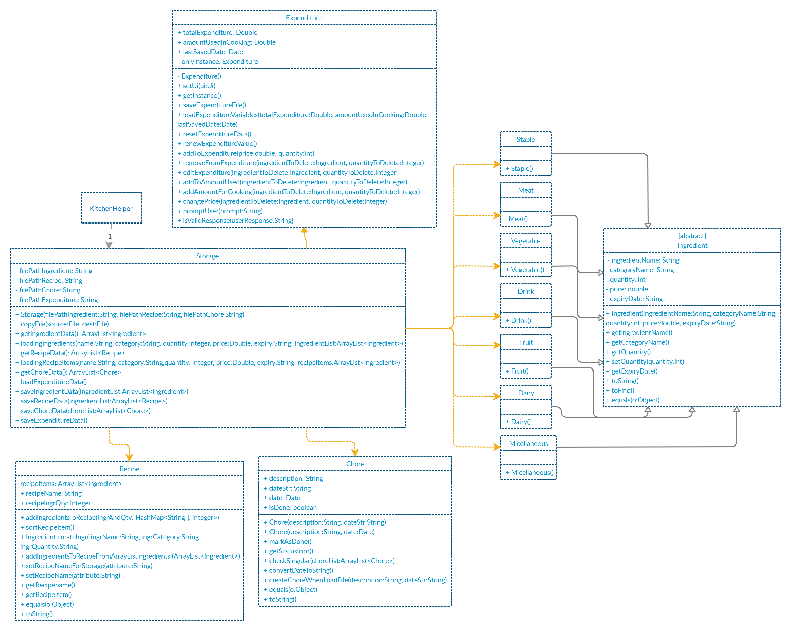

A Storage object is created by the KitchenHelper class to handle the loading and saving of ingredients, recipes and chores data.

The Storage() method acts as a constructor with filepaths to local save files for ingredients, recipes and chores data.

The getIngredientData(), getRecipeData() and getChoreData() methods are used to read saved data from local files into the current session of KitchenHelper. loadingIngredients() and loadingRecipeItems() methods are called in getIngredientData() and getRecipeData() respectively to sort out which Ingredient object class each object belongs to.

The saveIngredientData(), saveRecipeData() and saveChoreData() methods write the current state of KitchenHelper into the local save files by calling them in command classes such as AddChoreCommand and DeleteIngredientCommand.

[&#8593; Return to Top](#developer-guide)

### 3.6. Common Classes 
Classes used by multiple components are in the `seedu.kitchenhelper.object` package.

[&#8593; Return to Top](#developer-guide)

## 4. Implementation
This section describes some details on how the features are being implemented. All recipe/ ingredient/ chore-related features can be broken down into 4 distinct functionality, addition, listing, deletion and searching.

### 4.1.Ingredient-related Features
#### 4.1.1. Addition of ingredient

The addition of the ingredient feature allows the user to keep track of the ingredients in the ingredient’s list.   
For example, `addingredient /n beef /c meat /q 2 /p 20 /e 18/02/2020` will add the ingredient `beef` 
which have the following attributes:  category `meat`, quantity `2`, price `$20` and expiry `18/02/2020`  

##### Implementation

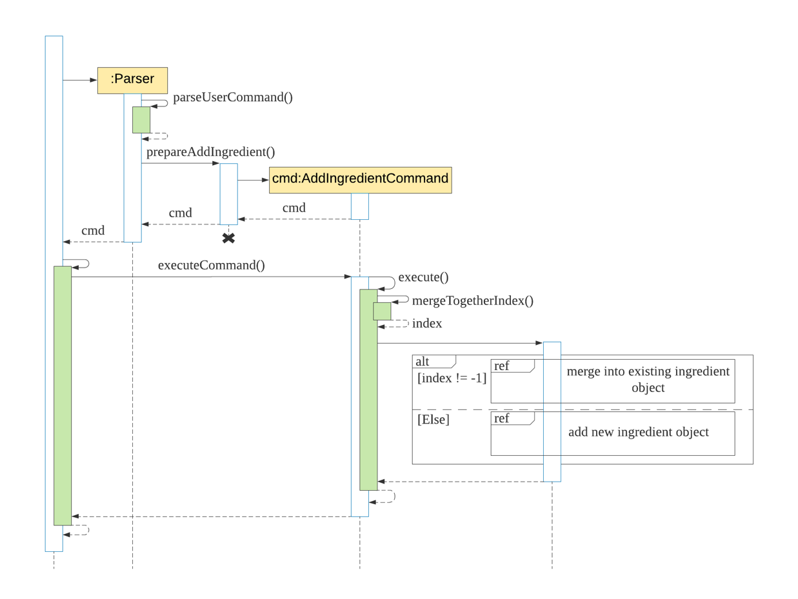 

The following steps explained “Sequence diagram for an example `addingredient` command”:  
1. The user enters `addingredient /n beef /c meat /q 2 /p 20 /e 18/02/2020`.  
2. `KitchenHelper` calls `Parser#parseUserCommand()`.  
3. `Parser#parseUserCommand()` will call its own method `Parser#prepareAddIngredient()`.  
4. `Parser#prepareAddIngredient()` will first validate the attributes and create an object `AddIngredientCommand` with the attributes if successful.  
5. `KitchenHelper` calls it own method `executeCommand()` to execute the method in `AddIngredientCommand#execute()`.  
6. On `AddIngredientCommand#execute()`, ingredient is added and return of the message.  

[&#8593; Return to Top](#developer-guide)

#### 4.1.2. List all/ specific ingredient(s)
The list feature allows showing details of Ingredients added by the user.  All ingredients added will be shown in a sorted order, by expiry, and shown by categories. The function will require a valid string , which belongs to `all/dairy/drink/fruit/meat/miscellaneous/staple/vegetable`, 
to be added as a parameter. Failure to do so will trigger an exception where the user will be notified of an invalid command and the syntax of the listing of the ingredients will be displayed. 

##### Implementation
When the user attempts to list the details of a particular category of ingredients, the `listIngredientCommand`, ‘Parser’ and `Ingredient` class will be accessed and the following sequence of actions are called to list details of  a particular category Ingredient list: <br>
1. User executes `listingredient all` 
    2. A `Ui` object will be created and calls `Ui#getUserCommand()`
    3. Input will be parsed in `Command#parseUserCommand()` and identified with the keyword `listingredient`.
    
2. Parsing of user input and creation of command object
    2.This will automatically trigger the parsing of the user’s input string into a suitable format for the listing of a particular category of  `ingredient` object in `Command#prepareListIngredient()`.
    3. A `ListIngredientCommand` object will be created.
       
3. Executing Command
    2. The newly created object will call `#ListIngredientCommand#execute` which starts the process of listing a particular category’s ingredient details, thus calling `ListIngredientCommand#listIngredients()`.
    3. The existing ingredientList arraylist and the category of the chosen ingredient category  will be passed through to the `ListIngredientCommand#listIngredients()`.
    4. The function will find if the category name is valid, thus, creates `CommandResult` result storing the details of the ingredient belonging to the particular category.
    
4. The details will then be printed onto the console using `Ui#showResultToUser(result)`.
    

##### Design Considerations
Aspect: Finding the category name and print out ingredient belonging to the category

Alternative 1: Looping through the whole ingredientList arraylist to find out all possible category name, then, do sorting and return result

|     |     |
|-----|-----|
|**Pros** | The program will be able to detect all category name inside the ingredientList arraylist. |
|**Cons** | This method will be slow when facing a huge amount of data in the arraylist as the program may have to go through every single item in the arraylist. |

Alternative 2 (current choice): Creating a fixed array which includes the order and all possible category names.

|     |     |
|-----|-----|
|**Pros** | Users would be able to get the details of the particular recipe accurately and fast. |
|**Cons** | Program will not be able to handle any ingredient which isn’t belonging to the category names in the fixed array.  |

[&#8593; Return to Top](#developer-guide)

#### 4.1.3. Delete all/ specific ingredients(s)
The deletion feature for ingredients allows the user to delete ingredients either by the name or index of the ingredients. In addition to that, it allows users to reduce the quantity of a specific ingredient. 

##### Implementation
When the user attempts to reduce the quantity of ingredient at index 1 of the ingredients inventory by 4,  the `Kitchen Helper`, ‘Parser’ and ‘DeleteIngredientCommand` class will be called upon. The following sequence of steps will then occur: 

The following image below shows the sequence of steps for step 1 and 2:
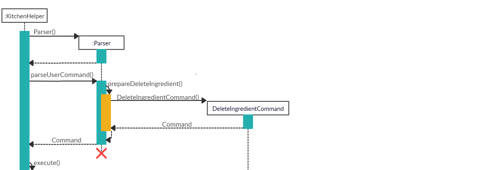

1. The user keyed in `deleteingredient /i 1 /q 4`.
   
    1. A `UI` object will be created and it will call `UI#getUserCommand()` method to take in the input that the user has keyed in.
    2. A `String` object will be returned and saved into the `userCommandInput` variable in `Kitchen Helper`.
    3. The variable `userCommandInput` is being parsed into the `Parser` class as an argument for this method `Parser#parseUserCommand`.
    
    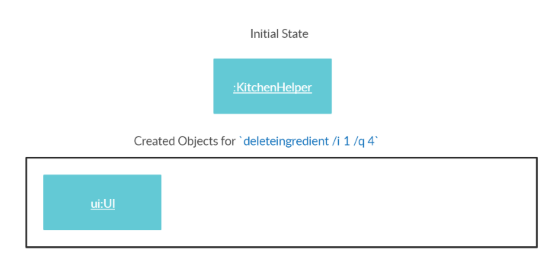 
    
2. The command inserted by the user is being parsed into the `Parser` and a new `Command` object is being created. 
    
    1. The variable `userCommandInput` will be identified as `deleteingredient` in the `Parser#parseUserCommand()`.The `Parser#prepareDeleteIngredient()` is being called to prepare the `userCommandInput` string to create a `DeleteIngredientCommand` object.
    2. The `DeleteIngredientCommand` object is created with the ingredientIndex and quantity set to 4. 
    
    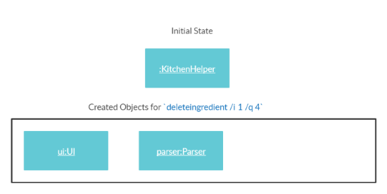
    
3. After creating `DeleteIngredientCommand` object, this Command will now be executed. 
    
    The following image below shows the sequence for the next steps:
    
    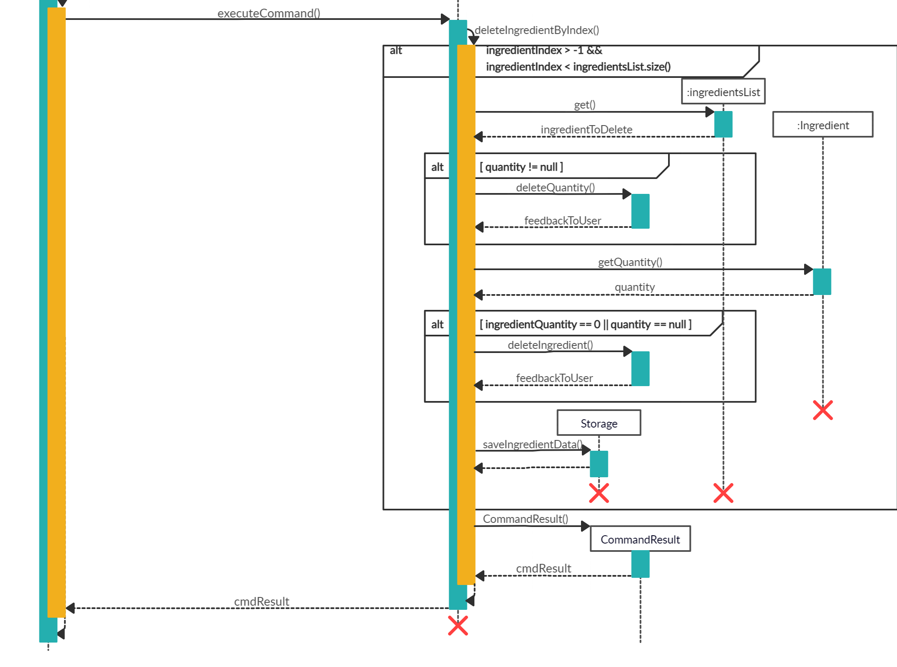
    
    1. The `DeleteIngredientCommand#execute()` will be called which in turned called DeleteIngredientCommand#deleteIngredientByIndex()`. 
    2. Since the `quantity` of this ingredient is not null, the `DeleteIngredientCommand#deleteQuantity()` will be called to reduce the quantity of this ingredient.  
    3. When `DeleteIngredientCommand#deleteQuantity()` has returned, the program will get the quantity of the current ingredient after deduction. If the quantity is zero or null, the `DeleteIngredientCommand#deleteIngredient()` will be called to remove `ingredient` from the `ingredientsList` which contains all the ingredients. 
    4. Then, `Storage#saveIngredientData()` will be called to save the current `ingredientsList` into an output file.
    5. Lastly, a String called `feedbackToUser`will be returned to the user to inform the user of the outcome of the command. 
    
    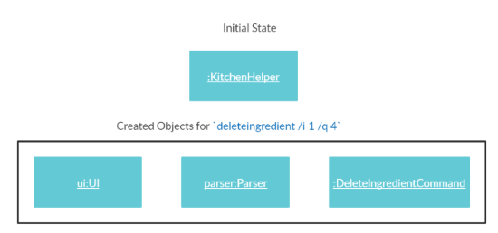
    
4.  The details will then be printed onto the console using `Ui#showResultToUser(result)`.

The following shows the full sequence diagram for this command:

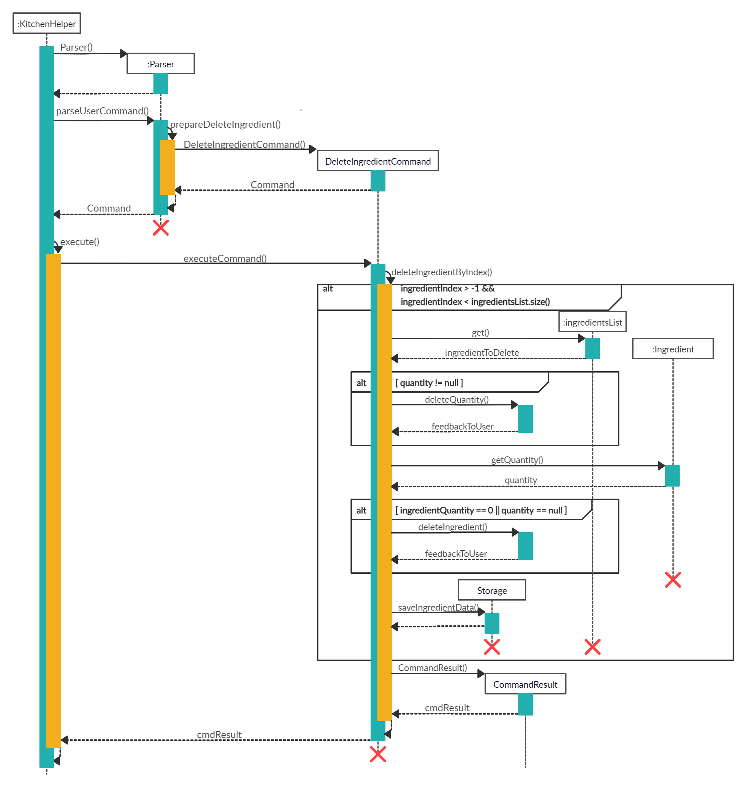

##### Design Considerations
Aspect 1: How to differentiate `deleteingredientByQuantity` and `deleteIngredient` <br>
<br>
Alternative 1: The `quantity` of ingredient in `DeleteIngredientCommand` constructor is set to the `quantity` that was inputted by the user. In the case where the user would like to delete an ingredient, the `quantity` variable will be set to `null`. (Current Choice)

|     |     |
|-----|-----|
|**Pros**|Only a `quantity` variable needs to be set. This increases more convenience and no overload of constructors.|
|**Cons**|Dependent on the variable to check if the ingredient is to be deleted. | 

Alternative 2: Create 1 more constructor just for deduction of quantity for ingredients. <br>

|     |     |
|-----|-----|
|**Pros**|This gives us more flexibility on what object can be created with different variables.|
|**Cons**|There may be an overload of constructors.|

<br>
Aspect 2: Calling of function for deletion of `ingredient` when `ingredient` has the quantity of zero.
<br><br>
Alternative 1: Two non-nested `if-else` blocks to cater for `deleteQuantity` and `deleteIngredient`. (Current Choice)

|     |     |
|-----|-----|
|**Pros**|SLAP is not violated. |
|**Cons**|Longer lengths of codes. | 
<br>
Alternative 2: One nested `if-else` block to cater for `deleteQuantity`and `deleteIngredient`

|     |     |
|-----|-----|
|**Pros**|Concise block of `if-else`.|
|**Cons**|The `if-else` block will be nested with another `if-else` block. This will violate the SLAP in code quality and the program will have to check for multiple conditions instead of one.|
<br>
Aspect 3: Deletion by index instead of name for ingredients 
<br>
<br>
Alternative 1: Deletion by index only (Current Choice)

|     |     |
|-----|-----|
|**Pros**|Only a very specific ingredient can be deleted. Only need to get the ingredient from the list of ingredients by index. It is a more specific way to get the ingredient to delete. |
|**Cons**|Users will not be able to delete the ingredient by name.| 

Alternative 2: Deletion by both index and name 

|     |     |
|-----|-----|
|**Pros**|Users will be able to delete by ingredients' name and index. |
|**Cons**|There may be confusion when it comes to the deletion by name for the users as the algorithm that was supposed to be implemented for deletion by name will delete the first instance of ingredient that is found. In the case, whereby the list of ingredients have two `apples` but different expiry date and the user just want to delete the second `apple` that has a later expiry date. It will not be able to do so through deletion of name as the first instance of `apple` is the one that has an earlier expiry date. | 

In the end, for `aspect 3`, we have chosen `alternative 1` which is to delete by index for ingredients only so that the users can have a more convenient time in deleting the specific ingredient that they want to delete. However, deletion by name for ingredients may be implemented and enhanced in the future implementations once we have finalised our idea for its implementation. 


[&#8593; Return to Top](#developer-guide)

#### 4.1.4. Search for ingredients based on keyword(s)

The search for ingredients feature allows the user to find ingredients using a keyword in the ingredient’s list.  
For example, `searchingredient beef` will find all the ingredients that contain `beef`.  

##### Implementation  

 

The following steps explained sequence diagram for `searchingredient` command:  
1. The user enters `searchingredient beef`.  
2. `KitchenHelper` calls `Parser#parseUserCommand()`.  
3. `SearchIngredientCommand` object is created with the keyword passed in.  
4. `KitchenHelper` calls it own method `executeCommand()` to execute the method in `SearchIngredientCommand#execute()`.  
5. On `SearchIngredientCommand#execute()`, display the list of ingredients that matches the keyword. 

##### Design considerations:

Aspects: How `searchingredient` executes:  

- Alternative 1 (current choice): Find if the keyword is part of the substring of the ingredient, 
`[Meat] Beef Qty:3 $20.00 Exp:18/03/2020.`  

|     |     |
|-----|-----|
|**Pros** | 1. Easily to find by any attributes such as category, ingredient’s name,  quantity, price and expiry date.|  
|**Cons** | 1. Searching `beef [meat]` will fail to show any matching result.|

- Alternative 2: Take in all the predicates given by the user and find using the predicates as a keyword

|     |     |
|-----|-----|
|**Pros** | 1. More accurate searching of the ingredient is available for the user.|  
|**Cons** | 1. Requires users to enter more precise predicate keywords which could be more inconvenient.|

[&#8593; Return to Top](#developer-guide)

### 4.2. Recipe-related Features
#### 4.2.1. Addition of recipe
Users can add a new recipe to the application where there must be at least one or more `ingredient`s. The failure to do so will trigger an exception where the user will be notified of an invalid command and the syntax of the addition of recipe will be displayed. 

> It is important that the name of the new recipe has not appeared in the list of recipes in the application.

When the user attempts to create a new recipe, the `AddRecipeCommand`, ‘Parser’ and `Recipe` class will be accessed and the following sequence of actions are called to create a `recipe` object:

##### Implementation 
When the user attempts to create a new recipe, the `AddRecipeCommand`, ‘Parser’ and `Recipe` class will be accessed and the following sequence of actions are called to create a `recipe` object:

1. User executes `addrecipe /n Chicken Salad /i Chicken Breast:2:meat, Lettuce:4:vegetable` 
    1. A `Ui` object will be created and calls `Ui#getUserCommand()`
    1. Input will be parsed in `Command#parseUserCommand()` and identified with the keyword `addrecipe`.
    
    
2. Parsing of user input and creation of command object
    1. This will automatically trigger the parsing of the user’s input string into a suitable format for the addition of `recipe` object in `Command#prepareAddRecipe()`.
    1. A `AddRecipeCommand` object will be created and calls `AddRecipeCommand#setAttributesOfCmd()` to set the contents of the command into reader friendly formats.
    
    
3. Executing Command
    1. The newly created object will call `#AddRecipeCommand#execute` which starts the process of adding a recipe, thus calling `Recipe#AddRecipe()`.
    1. A `Recipe` object will be created with its name that was parsed in step 2.
    1. An additional step is included where a check for an existing recipe with the same name is conducted with `#AddRecipeCommand#checkIfRecipeExist()`. A `KitchenHelperException` exception will be triggered when there is an existing recipe.
    
    
4. `Ingredient`s parsed in step 2 will be added to the newly created recipe according to their category through the calling of `Recipe#addIngredientsToRecipe()`.
	
	

All description and warnings to the user utilises the `UI` class, which controls the printing of the text on the console. 

The following sequence diagram shows how the `addrecipe` command works

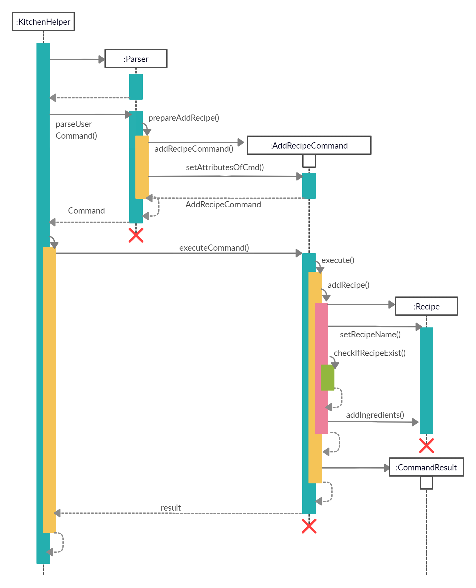 

##### Design Considerations
Aspect: Parsing of the user’s input command

Alternative 1 (current choice): The key parameters that are required are divided by the delimiter of ‘/’ followed by a specific letter. `(i.e. /i)`

|     |     |
|-----|-----|
|**Pros** | User would be able to have strings that may contain spaces (i.e. /n Chicken Salad /i Breast meat:2:meat) |
|**Cons** | The order of delimiters needs to be standardized, users will not be able to re-order the delimiters. |

Alternative 2: Multiple prompts for user’s input of a recipe name and ingredient(s)

|     |     |
|-----|-----|
|**Pros** | Users would not have to make sure that their command is syntactically right |
|**Cons** | The constant prompting could subject the application to a negative experience in the difficulty to use the commands. |

Alternative 3: User’s command are divided by space

|     |     |
|-----|-----|
|**Pros** | The parsing can be easily done by calling Java built-in function `.split()` |
|**Cons** | Values for each variable cannot contain spaces which makes the application restrictive. |

[&#8593; Return to Top](#developer-guide)

#### 4.2.2. List all/ specific recipe(s)
The list feature allows showing details of a particular recipe created by the user.  All ingredients added into the recipe will be shown in a sorted order and shown by categories. The function will require valid string of a integer or `all` to be added as a parameter. Failure to do so will trigger an exception where the user will be notified of an invalid command and the syntax of the listing of the recipe will be displayed. 

##### Implementation
When the user attempts to list the details of a particular recipe, the `listRecipeCommand`, ‘Parser’ and `Recipe` class will be accessed and the following sequence of actions are called to list details of  a particular `recipe` object:
1. User executes `listrecipe 1`  
    2. A `Ui` object will be created and calls `Ui#getUserCommand()`
    3. Input will be parsed in `Command#parseUserCommand()` and identified with the keyword `listrecipe`.
    
2. Parsing of user input and creation of command object
    2.This will automatically trigger the parsing of the user’s input string into a suitable format for the listing of `recipe` object in `Command#prepareListRecipe()`.
    3. A `ListRecipeCommand` object will be created.
       
3. Executing Command
    2. The newly created object will call `ListRecipeCommand#execute` which starts the process of listing a particular recipe’s details, thus, calling `ListRecipeCommand#listRecipe()`.
    3. The existing recipeList arraylist and the item number of the chosen recipe will be passed through to the `ListRecipeCommand#listRecipe()`.
    4. The function will find if the item number is valid and contains details of the recipe, thus, creates a CommandResult storing the details of the particular recipe.
    
4. The details will then be printed onto the console using `Ui#showResultToUser(result)`.
    

##### Design Considerations
Aspect: Finding the recipe requested by the user.

Alternative 1: Looping through the whole recipeList arraylist to find the recipe requested by the user.

|     |     |
|-----|-----|
|**Pros** | The program will be able to locate the recipe accurately. |
|**Cons** | This method will be slow when facing a huge amount of data in the arraylist as the program may have to go through every single item in the arraylist. |

Alternative 2 (current choice): Using arrayList.get(item) to get the recipe requested by the user.

|     |     |
|-----|-----|
|**Pros** | Users would be able to get the details of the particular recipe accurately and fast. |
|**Cons** | Without proper checks done before running the command, it will result in error if the number indicated by the user exceeds the arraylist / does not exist in the arraylist.  |

[&#8593; Return to Top](#developer-guide)

#### 4.2.3. Cooking of recipe
The feature allows the user to cook a recipe if there are sufficient ingredients. The user will also indicate how many pax this recipe would be cooked for.

##### Implementation 
When the user attempts to cook `Chicken Salad` recipe from `Kitchen Helper`, the `Kitchen Helper`, `Parser` and `cookRecipeCommand` class will be called upon. The following sequence of steps will then occur:
1. The user keyed in "cookrecipe /n `Chicken Salad`".
    
    1. A `UI` object will be created and it will call `UI#getUserCommand()` method to take in the input that the user has keyed in. 
    2. A `String` object will be returned and saved into the `userCommandInput` variable in `Kitchen Helper`. 
    3. The variable `userCommandInput` is being parsed into the `Parser` class as an argument for this method `Parser#parseUserCommand()`.
   
    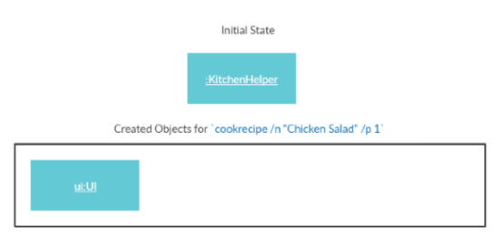
    
2. The command inserted by the user is being parsed into the `Parser` and a new `Command` object is being created. 
    
    1. The variable `userCommandInput` will be identified as `cookrecipe` in the `Parser#parseUserCommand()`.The `Parser#prepareCookRecipe()` is being called to prepare the `userCommandInput` string to create a `CookRecipeCommand` object.
    
    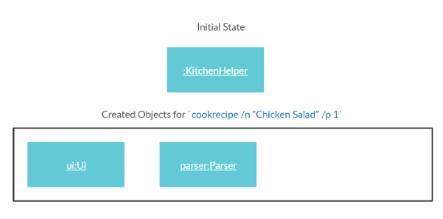
    
3. The command is now being executed.

    1. The `CookRecipeCommand#execute()` will be called.
    2. The `CookRecipeCommand#cookRecipe()` is called and it checks whether the recipe inputted by the user exists by calling the `CookRecipeCommand#checkIfRecipeExists()` method.
    3. If recipe exists, the `CookRecipeCommand#checkIfRecipeExists()` method will return the index of the recipe, else it will return a number that is bigger than the size of `recipelist`. In this case, the recipe `Chicken Salad` exists, so it will return the index of the recipe 
    4. Next, it is to check if there are sufficient non-expiring ingredients to be deducted from the ingredients' inventory to cater for the number of pax for the specific recipe by calling `CookRecipeCommand#checkForSufficientIngredients()` and `CookRecipeCommand#checkNotExpiredIngredientQty()` which their results are saved into `sufficientIngr` and `suffButLessExpiredIngr` boolean values respectively. 
    
    
    
    5. Then, three of the following cases may happen:
	   1. If both `sufficientIngr` and `suffButLessExpiredIngr` return true
	       1. `CookRecipeCommand#deductIngredients()` will be called to deduct the ingredients in the ingredients' inventory.
	       2. Then, `Storage#saveIngredientData()` will be called to save the current `ingredientsList` into an output file.
	   2. If `sufficientIngr` returns true but `suffButLessExpiredIngr` returns false or both `sufficientIngr` and `suffButLessExpiredIngr` return false and the size of `expiredIngrNames` is not zero
	       1. `CookRecipeCommand#craftExpiredList()` will be called to craft the list of expired ingredients which will be returned to tell the users the ingredients that are expired. 
    6. Lastly, a String called `feedbackToUser` will be returned to the user to inform the user of the outcome of the command.
    
    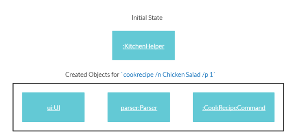
    
4. The details will then be printed onto the console using `Ui#showResultToUser(result)`.

The following shows the full sequence diagram for this command:

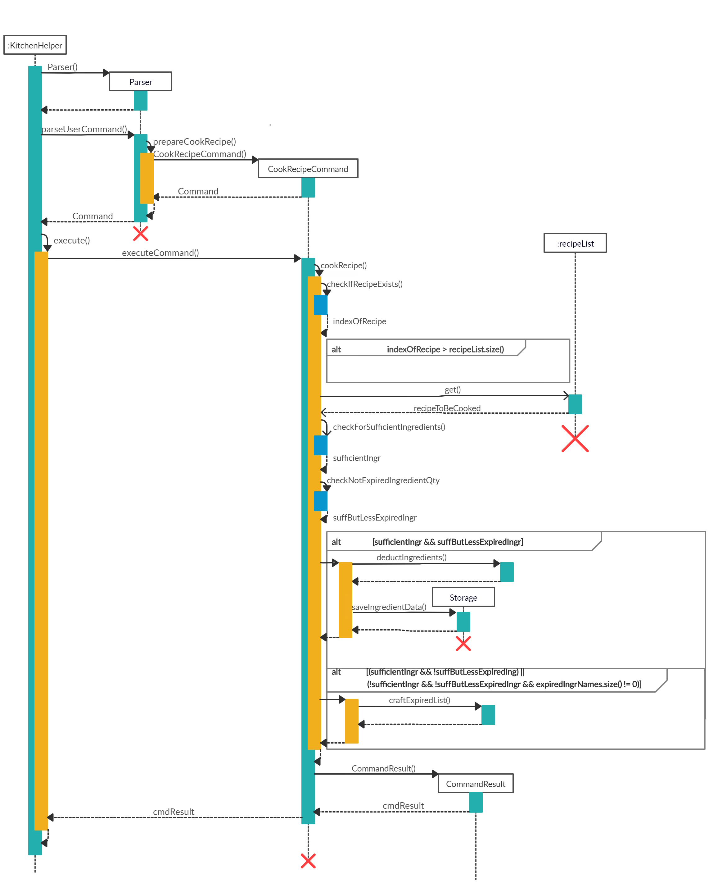

##### Design considerations
Aspect: Preparing the deduction of ingredients when cooking a recipe

Alternative  1 (current choice): Checks for existence of recipe, existence of ingredients for the specified recipe and sufficiency of ingredients

|   |   |
|---|---|
|**Pros**| Minimizes erroneous deduction of insufficient and nonexistent ingredients |
|**Cons**|Additional computation and overhead |

Alternative 2: Deductions are to be made to existing and available ingredients and users are notified when there are insufficient ingredients

|   |   |
|---|---|
|**Pros**| Lesser overhead as there is lesser checks to be done
|**Cons**| Hidden bugs and exceptions have to be well-covered to ensure that the deduction would be of the right value

Aspect: Searching for the corresponding ingredients of a recipe/ Searching through list of recipes to check for existence of recipe
Alternative 1 (current choice): Linear search, iterate through the arraylist of ingredients/ recipes and checking

|   |   |
|---|---|
|**Pros**| Lesser use of complex data structure will save memory |
|**Cons**| Not optimal as search will be O(n), larger amount of data may take a longer time |

Alternative 2: building an index on the first letter of the recipe name

|   |   |
|---|---|
|**Pros**| More efficient search as pool of search space would be significantly smaller
|**Cons**| Needs to be constantly maintained which incurs overhead.

[&#8593; Return to Top](#developer-guide)

#### 4.2.4. Delete all/ specific recipe(s)
The deletion feature for specific recipes allows the user to delete recipes either by the name or index of the recipe. 

##### Implementation
When the user attempts to delete the `Chicken Rice` recipe from Kitchen Helper, the `Kitchen Helper`, `Parser` and `DeleteRecipeCommand` class will be called upon. The following sequence of steps will then occur: 
1. The user keyed in “deleterecipe /n `Chicken Rice`".
    
    1. A `UI` object will be created and it will call `UI#getUserCommand()` method to take in the input that the user has keyed in. 
    2. A `String` object will be returned and saved into the `userCommandInput` variable in `Kitchen Helper`. 
    3. The variable `userCommandInput` is being parsed into the `Parser` class as an argument for this method `Parser#parseUserCommand()`.
    
    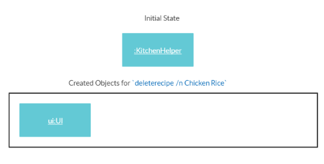
    
2. The command inserted by the user is being parsed into the `Parser` and a new `Command` object is being created. 
    
    1. The variable `userCommandInput` will be identified as `deleterecipe` in the `Parser#parseUserCommand()`.The `Parser#prepareDeleteRecipe()` is being called to prepare the `userCommandInput` string to create a `DeleteRecipeCommand` object.
    
    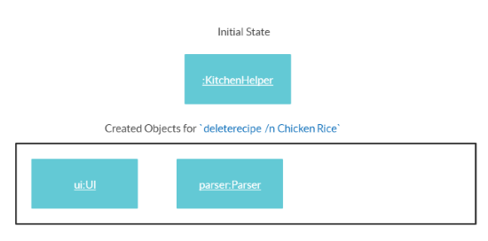
    
3. The command is now being executed.
    
    1. The `DeleteRecipeCommand#execute()` will be called.
    2. As this is a deletion by recipe name, the `recipeIndex` variable is set as null. As the variable is null, `DeleteRecipeCommand#deleteRecipeByName()` will be called.
    3. Next, the `DeleteRecipeCommand#getRecipeIndex()` to get the index based on the recipe name that the user has inputted. With the given index, `DeleteRecipeCommand#deleteRecipe()` will be called to delete the recipe. 
    4. Lastly, a String called `feedbackToUser` will be returned to the user to inform the user of the outcome of the command. 
    
    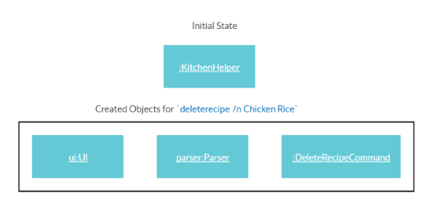
    
4. The details will then be printed onto the console using `Ui#showResultToUser(result)`.

The following shows the full sequence diagram for this command:

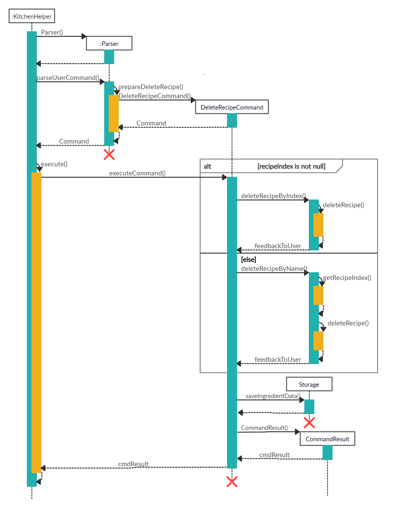

##### Design Considerations
Aspect: How is the `DeleteRecipeCommand` initialise. <br>
<br>
Alternative 1 (Current Choice): Usage of 2 constructors <br>

|     |     |
|-----|-----|
|**Pros** | This gives us more flexibility on what object can be created with different variables since there are two methods of recipe deletion. |  
|**Cons** | There is an overload of constructors.|

Rationale for using this: As there are two different types of deletion, it would be simpler and increase cohesion as it is more easier to express these constructors' functionality at a higher level.

Alternative 2: Usage of 1 constructor <br>

|     |     |
|-----|-----|
|**Pros** |The Parser can call for one main default constructor. |
|**Cons** | The single constructor will need to deal with 2 different methods of deletion, causing the constructor to have more than one purpose.|

[&#8593; Return to Top](#developer-guide)

#### 4.2.5. Search for recipe based on keyword(s)

The search for recipe feature allows the user to find recipes using a keyword in the recipe’s list.  
For example, `searchrecipe Chicken` will find all recipes that contain `Chicken`.  


##### Implementation


The following steps explained sequence diagram for `searchrecipe` command:  
1. The user enters `searchrecipe Chicken`.  
2. `KitchenHelper` calls `Parser#parseUserCommand()`.  
3. `SearchRecipeCommand` object is created with the keyword passed in.  
4. `KitchenHelper` calls it own method `executeCommand()` to execute the method in `SearchRecipeCommand#execute()`.  
5. On `SearchRecipeCommand#execute()`, display the list of recipe's name that matches the keyword.

##### Design considerations:

Aspects: How `searchrecipe` executes:  

- Alternative 1 (current choice): Find if the keyword is part of the substring of the recipe’s name 
and returns the recipe’s name and the index of recipe in the recipe’s list.  

|     |     |
|-----|-----|
|**Pros** | 1. Easy to find similar recipe by their name.|  
|**Cons** | 1. Only shows the different recipe that contains the keyword.|

- Alternative 2: Find the keyword within the recipe’s ingredient.  

|     |     |
|-----|-----|
|**Pros** | 1. More accurate searching of the recipe that uses the ingredients.|  
|**Cons** | 1. Could be more memory intensive to find if the list is huge.|

[&#8593; Return to Top](#developer-guide)

### 4.3. Chore-related Features
#### 4.3.1. Addition of chore
The feature for addition of `chore`s allows the user to add `chore`s to a list to keep track of their completion. For example, `addchore buy groceries /by Monday 12pm` adds the `chore` `buy groceries` with deadline `Monday 12pm` to the `chore` list, and marks it as undone. 

##### Implementation  


Explanation of the sequence diagram above:
1. The user inputs `addchore buy groceries /by Monday 12pm`.  
2. The `Kitchen Helper` class calls `Parser#parseUserCommand()` which will split the user input into 2 substrings, the command and its attributes.  
3. The `AddChoreCommand` has been determined by a switch case, and the `Parser#prepareAddChore` method is called. 
4. If the method successfully extracts the task description and deadline, a new `AddChoreCommand` object is created. Otherwise, a new `InvalidCommand` object is created.  
5. After which, the `AddChoreCommand` object will be returned to the `Kitchen Helper` class.
6. The `Kitchen Helper` class will call the `execute()` method in the `AddChoreCommand` class, which calls its own `addChore()` method.
7. This method will create a new `chore` and add it to the `chore` list.
8. The execute() method returns a String to inform the user of the successful outcome. 

##### Design considerations:

- We came up with two ways that a user can set the deadline, either as a String or as a Date object. 

|     |     |
|-----|-----|
|**Pros** | Increases flexibility if the user is unable to specify a date or time to complete the chore by.|  
|**Cons** | Unable to alert the users of approaching deadlines that are set as Strings.|

[&#8593; Return to Top](#developer-guide)

#### 4.3.2. List all/ specific chore(s)
The feature to list `chore`s allows the user to view the `chore`s currently in the list and their completion statuses. For example, `listchore`.
##### Implementation  

1. The user inputs `listchore`.
2. The `Kitchen Helper` class calls `Parser#parseUserCommand()` which will split the user input into 2 substrings, the command and its attributes, which would be empty in this case. 
3.   The `ListChoreCommand` has been determined by a switch case, and the `Parser#prepareListChore` method is called.
4.   If the substring of attributes is empty, a new `ListChoreCommand` object is created. Otherwise, an exception is thrown.
5.   After which, the `ListChoreCommand` object will be returned to the `Kitchen Helper` class. 
6.   The `Kitchen Helper` class will call the `execute()` method in the `ListChoreCommand` class, which calls its own `listChore()` method. 
7.   This method will display each `chore` item in the list line by line or indicate an empty list if the list is empty.
8.   The `execute()` method returns a String containing the formatted list of `chore`s to display. 
 
[&#8593; Return to Top](#developer-guide)

#### 4.3.3. Delete all/ specific chore(s)
The feature for deletion of `chore`s allows the user to remove the `chore` specified by the index in the list. For example, `deletechore 1` deletes the first `chore` in the `chore` list. 
##### Implementation  

1. The user inputs `deletechore 1`.
2.   The `Kitchen Helper` class calls `Parser#parseUserCommand()` which will split the user input into 2 substrings, the command and its attributes. 
3.   The `DeleteChoreCommand` has been determined by a switch case, and the `Parser#prepareDeleteChore` method is called.
4.   If the method successfully obtains an integer, a new `DeleteChoreCommand` object is created. Otherwise, a new `InvalidCommand` object is created.
5.   After which, the `DeleteChoreCommand` object will be returned to the `Kitchen Helper` class. 
6.   The `Kitchen Helper` class will call the `execute()` method in the `DeleteChoreCommand` class, which calls its own `deleteChore()` method. 
7.   If the integer obtained is an index in the list, this method will remove the `chore` in that position from the `chore` list. Otherwise, an exception is thrown.
8.   The execute() method returns a String to inform the user if the outcome is successful.

[&#8593; Return to Top](#developer-guide)

#### 4.3.4. Search for chore based on keyword(s)

The search for chore feature allows the user to find chores using a keyword in the chore’s list.  
For example, `searchchore groceries` will find all chores that contain `groceries`.  

##### Implementation  

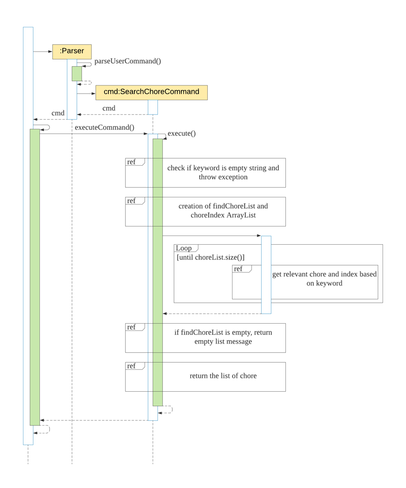

The following steps explained sequence diagram for `searchchore` command:  
1. The user enters `searchchore groceries`.  
2. `KitchenHelper` calls `Parser#parseUserCommand()`.  
3. `SearchChoreCommand` object is created with the keyword passed in.  
4. `KitchenHelper` calls it own method `executeCommand()` to execute the method in `SearchChoreCommand#execute()`.  
5. On `SearchChoreCommand#execute()`, display the list of chore that matches the keyword.

##### Design considerations:

- Alternative 1 (current choice): Find if the keyword is part of the substring of the chore, 
`[x] buy groceries (by: Tuesday 12pm)`.   
 
|     |     |
|-----|-----|
|**Pros** | 1. Easily to find by any attributes such as description and date.|  
|**Cons** | 1. Searching `buy groceries [x]` will fail to show any matching result.|

- Alternative 2: Take in all the predicates given by the user and find using the predicates as a keyword  

|     |     |
|-----|-----|
|**Pros** | 1. More accurate searching of the chore is available for the user..|  
|**Cons** | 1. Requires users to enter more precise predicate keywords which could be more inconvenient.|

[&#8593; Return to Top](#developer-guide)

### 4.4. Storage
#### 4.4.1. Select files to load from and save to

The select files to load from and save to feature allows the user to choose an option to either load their data from the auto-save mode or the manual-save mode. The auto-save mode keeps track of and stores all changes made in the program and provides the user with the most recent representation of their inventory. While the manual-save mode stores the state of the program data from the most recent usage of the save command by the user. 

If the user chooses the manual-save mode, it will overwrite all the data stored in auto-save mode. However, any subsequent changes made to the program data will be saved by auto-save mode regardless of initial load options. To save by manual-save mode, the user will have to use the save current state function with the save command (see section 4.4.2)[4.4.2. Save current state](#442-save-current-state).
    
##### Implementation
1. For instance, if the User selects to load files from auto-save mode, User executes `1`
	1. A `Ui` object will be created and calls `Ui#getUserChoice()` and returns String `UserChoice`. 
	1. The `Ui` object then calls `Ui#validUserChoice()` with `UserChoice` as the parameter. If `UserChoice` is invalid, `Ui#validUserChoice()` will call `Ui#askForReInput()`.
	1. The variable `userCommandInput` is being parsed into the `Parser` class as an argument for this method `Parser#parseUserCommand()`.

2. Creation of storage object
    
    Ingredient data:
    1. A `Storage` object will be created and calls `Storage#getIngredientData()` to load and parse the contents of ingredient save file into a newly created `ingredientList ArrayList<Ingredient>`.
    1. ` Storage#getIngredientData()` will call `Storage#loadingIngredient()` to create `Ingredient` objects based on the category type of ingredients in the `ingredientList`.
    
    Recipe data:
    1. A `Storage` object will be created and calls `Storage#getRecipeData()` to load and parse the contents of recipe save file into a newly created `recipeList ArrayList<Recipe>`.
    1. `Storage#getRecipeData()` will create a `Recipe` object and `recipeItems ArrayList<Ingredient>`. It then calls `Storage#loadingRecipeItems()` to create `Ingredient` objects based on the category type of ingredients in each recipe into the `recipeItems`. Every ` recipeItems` of each recipe will then be added into `recipeList`.

    Chore data:
    1. A `Storage` object will be created and calls `Storage#getChoreData()` to load and parse the contents of chore save file into a newly created `choreList ArrayList<Chore>`.

All description and warnings to the user utilises the UI class, which controls the printing of the text on the console.

The sequence diagram below summarizes how loading data works:
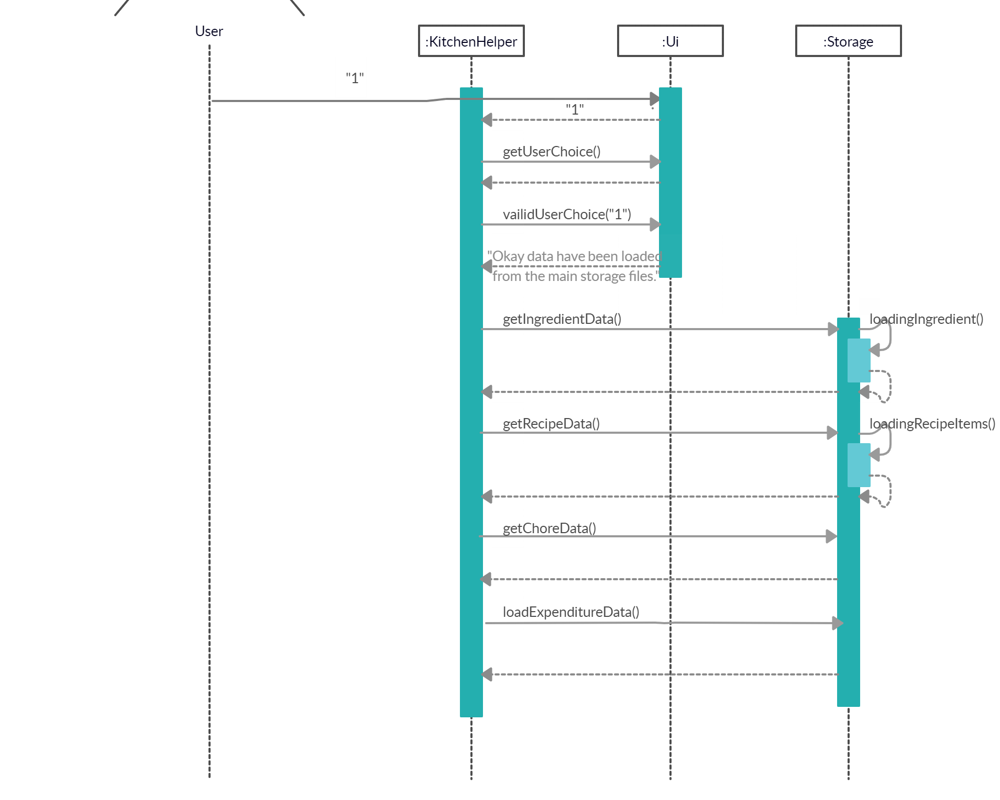
##### Design considerations:
Aspects: How saving of files executes:  

- Alternative 1 (current choice): Overwriting files with entire current ArrayLists every time changes are made.

|     |     |
|-----|-----|
|**Pros** | Easier to implement when it comes to delete commands as there is no need to loop through the whole ArrayList to find and compare the object to delete and update files.|  
|**Cons** | Takes more time to load and save.|

- Alternative 2: Appending the new changes to the files every time changes are made.

|     |     |
|-----|-----|
|**Pros** | Faster as there is no need to go through the whole ArrayList whenever we save since changes are appended individually.|  
|**Cons** | Difficult and slower to implement for commands that require deletion of objects.|

[&#8593; Return to Top](#developer-guide)

#### 4.4.2. Save current state
The save current state feature allows the user to store the current state of the program data by manual-save mode. Manual-save mode data will be updated and replaced with the current state when save command is implemented.

##### Implementation
The following steps explain how `save` command works:
1. The user enters `save`
2. `KitchenHelper` calls `Parser#parseUserCommand()` which splits the user’s input into 2 parts 
and enters a switch case for execution.  
3. `parseUserCommand` in the Parser object will call a method `SaveStateCommand`.  
4. On execute(), `Storage.copyFile()` will be called three times to copy contents of ingredients, recipes and chore save files into their respective manual-mode save files.

##### Design considerations:
Aspects: How saving of current state data executes:

- Alternative 1 (current choice): Using Files.copy to copy content of auto-save files to manual-save files.

|     |     |
|-----|-----|
|**Pros** | Easy to implement as less code is needed with Java 7 Files helper class.|  
|**Cons** | Relatively slow copy performance when file size increases.|

- Alternative 2: Using FileChannels to copy content of auto-save files to manual-save files.

|     |     |
|-----|-----|
|**Pros** | The FileChannels technique is usually faster than its alternatives such as basic streams.|  
|**Cons** | It may fail for very large files and more lines of codes are needed for implementation.|

[&#8593; Return to Top](#developer-guide)

### 4.5. Display Expenditure

[&#8593; Return to Top](#developer-guide)

### 4.6. Logging
Logging in the application refers to storing exceptions, warnings and messages that occur during the execution of Kitchen Helper. It was included to help developers to identify bugs and to simplify their debugging process. 

The `java.util.logging` package in Java is used for logging. The logging mechanism can be managed from the `KitchenHelper` class through the `kitchenLogs` logger object.

All control of the logger for the application can be viewed/ altered in the `setUpLogger()` method. The current settings for the logger are as follow:

- All logs of `Level.SEVERE` level will be shown on the console when an input/ program flow has caused a possible disruption to the execution of the program. (See the levels of logging below)
- All information above ‘Level.FINE’ level is logged into a log file, `KitchenLogs.log`.
- Logging is made to be displayed in the `SimpleFormatter` style where the date, class and error description are logged.

Logging Levels:
- `Level.SEVERE`: a serious failure, which prevents normal execution of the program, for end users and system administrators.
- `Level.WARNING`: a potential problem, for end users and system administrators.
- `Level.INFO`: reasonably significant informational message for end users and system administrators.
- `Level.CONFIG`: hardware configuration, such as CPU type.
- `Level.FINE`, `Level.FINER`, `Level.FINEST`: three levels used for providing tracing information for the software developers.

Additional logging can be done by adding the calling of the global logger and invoking the function `log()`. This will ensure that all loggings will be made to the same file across the various classes. 

An example is shown below:
```
public static final Logger kitchenLogs = Logger.getLogger(Logger.GLOBAL_LOGGER_NAME);
kitchenLogs.log(Level.WARNING, description_of_warning_here, e.toString());
```

[&#8593; Return to Top](#developer-guide)

## Appendices 
### Appendix A: Product Scope

__Target user profile__:

* Prefers desktop application over other types.  
* Can type fast.  
* Prefers typing over mouse input.  
* Comfortable with using command line interface.  
* Facilitate user to track kitchen related information easily.  
* Enables user to remove consumed items easily.  
* Reminds user of soon perishable food items.  
* Reminds user to stock up enough food.  

__Value proposition__: Manage food inventory quickly compared to a typical mouse or graphic user interface driven application which saves time and makes it more convenient.  

[&#8593; Return to Top](#developer-guide)

### Appendix B: User Stories

|Version| As a ... | I want to ... | So that I can ...|
|--------|----------|---------------|------------------|
|v1.0|housewife|add my groceries to the inventory|track my ingredients.|
|v1.0|user|track the list of ingredients|stock up before I cook a meal.|
|v1.0|user|delete an ingredient|so that i can remove the wrongly keyed item.|
|v1.0|user|decrease the quantity of an item in the inventory|see it reflects the current amount after consuming.|
|v1.0|user|create new recipes|keep a list of recipes in the application.|
|v1.0|user|view the list of recipe|view the ingredients that are needed for the recipe.|
|v1.0|user|delete the recipe|remove unwanted recipe.|
|v1.0|housewife|add chore to the list|remind myself of the tasks that needs to be completed.|
|v1.0|housewife|be able to see the chore list|check what is not completed.|
|v1.0|housewife|remove the task|delete  a task that was keyed wrongly..|
|v1.0|user|save all my ingredients|keep track of them when the application reloads.|
|v1.0|user|save all my recipes|choose which recipe that i would like to cook when the application reloads.|
|v1.0|user|save all my chores|view the chores that need to be done.|
|v1.0|frequent user|view all my past data|get the latest update on my inventory when the application reloads|
|v1.0|new user|view more information about the commands|learn to use the various commands.|
|v2.0|user|search for a specific ingredient|view the details regarding the ingredient.|
|v2.0|user|search the relevant recipe using a keyword|view the different recipe that are similar.|
|v2.0|user|search for a chore using a keyword|view the status of the chore.|
|v2.0|user|create unique recipe names|differentiate between my recipes.|
|v2.0|user|choose a recipe that contains sufficient ingredients|keep track of my ingredients and cook this meal.|
|v2.0|user|deduct the ingredients that i have from the recipe that i want to cook|save time from deleting manually.|
|v2.0|housewife|mark the task as done|track the uncompleted task.|
|v2.0|user|retrieve all of my past history that i have entered in the application|view them again.|
|v2.0|user|reset all my ingredients, chores, recipes|restart the application.|
|v2.0|user|deduct ingredients that expire first|do not waste my ingredients.|
|v2.0|user|be informed if I have sufficient ingredients to cook a specific recipe|find other recipes to cook.|

[&#8593; Return to Top](#developer-guide)

### Appendix C: Value proposition - Use cases

(For all use cases below, the __System__ is `Kitchen Helper` and the __Actor__ is the `user`, unless otherwise stated)
```
Use case: UC01 - Add an ingredient
MSS:
1. User purchases an ingredient.
2. User wants to add to System for tracking purposes.
3. System adds the ingredient.
Use case ends.

Extensions:
2a. System detects invalid format in the entered data.
  2a1. System throws invalid input format and shows a valid format example.
  Use case resumes at step 2.
2b. System detects zero quantity in the entered data.
  2b1. Systems alerts you to enter a quantity more than zero.
  Use case resumes at step 2.
2c. System detects a expired expiry date in the entered data.
  2c1. System alerts you that Expired ingredient detected in input. Please enter a non-expired expiry date.
  Use case resumes at step 2.
```
<br>

```
Use case: UC02 - Search for ingredient
MSS:
1. User wants to find ingredients.
2. User enters a keyword in the System.
3. System displays the ingredient related to the keyword.
Extentions: 
3a. No matching ingredients related to the keyword.
  3a1. Systems show no matching ingredient message
Use case resumes at step 2.
Use case ends.
```
<br>

```
Use case: UC03 - Search for recipe
MSS:
1. User wants to find similar recipes.
2. User enters a keyword in the System.
3. System displays the recipe's name related to the keyword.
Use case ends.
Extentions: 
3a. No matching recipe related to the keyword.
  3a1. Systems show no matching recipe message
Use case resumes at step 2.
Use case ends.
```
<br>

```
Use case: UC04 - Search for chore
MSS:
1. User wants to find chores.
2. User enters a keyword in the System.
3. System displays the chore related to the keyword.
Use case ends.
Extentions: 
3a. No matching chore related to the keyword.
  3a1. Systems show no matching chore message
Use case resumes at step 2.
Use case ends.
```

[&#8593; Return to Top](#developer-guide)

### Appendix D: Non-Functional Requirements

1. Should work on any mainstream OS as long as it has Java `11` or above installed.
2. An user with above average typing speed for regular English text (i.e. not code, not system admin commands) should be able to accomplish most of the tasks faster using commands than using the mouse.
3. Should not require user to install program file.
4. Should work for single user.
5. Should be able to run without internet connection.

[&#8593; Return to Top](#developer-guide)

### Appendix E: Glossary

* Category - The group of the ingredient belongs to
* Price - Unit cost of a single quantity
* Expiry - The expiry date of the ingredient
* *Mainstream OS* - Windows, Linux, Unix, OS-X  
 
[&#8593; Return to Top](#developer-guide)

### Appendix F: Instructions for Manual Testing

#### F.1. Launch and Shutdown

1. Initial launch
   1. Download the jar file, renamed it to `kitchenhelper` and copy into an empty folder.
   2. Open up command prompt or terminal.
   3. Change directory to where the jar file is located.
   4. Run the command `java -jar kitchenhelper.jar` 
   Expected: Shows a welcome message from Kitchen Helper.
   
#### F.2. Add an ingredient

1. Add an ingredient into Kitchen Helper.
   1. Prerequisites: List all the ingredient using the `listingredient all` command. 
   2. Test case: 'addingredient /n beef /c meat /q 3 /p 20.20 /e 03/03/2022'    
   Expected: Entry can be seen using `listingredient all` command.
   3. Test case: 'addingredient /n chicken /c meat /q 3 /p 3 /e 03/03/2020'  
   Expected: Expired ingredient detected in input. <br> Please enter a non-expired expiry date.
   4. Test case: 'addingredient /n milo /c drink /q 0 /p 1 /e 03/03/2022'
   Expected: Please enter a quantity more than 0.
   
#### F.3. List ingredient 

#### F.4. Delete an ingredient 
1. Delete an ingredient from Kitchen Helper.
   1. Prerequisites: List all the recipes using the `listingredient all` command.
   2. Test case (if ingredient index exists): `deleteingredient /i 1`<br>
   Expected: The ingredient will be deleted. It can be noticed by using the `listingredient all` command. 
   3. Test case (if ingredient index does not exists): `deleteingredient /i -1`<br>
   Expected: No ingredients are deleted. It can be noticed by using the `listingredient all` command. 
   4. Test case (if there is sufficient quantity to be reduced from the ingredient): `deleteingredient /i 1 /q 2`<br>
   Expected: The quantity of the ingredient will change as seen by using `listingredient all` command.
   5. Test case (if there are insufficient quantity to be reduced from the ingredient): `deleteingredient /i 1 /q 10`<br>
   Expected: The quantity of the ingredient will not changed as seen by using `listingredient all` command. 
   6. Test case (if the quantity of the ingredient is reduced to zero after deduction): `deleteingredient /i 1 /q 1`<br>
   Expected: The ingredient will be deleted as its final quantity is zero. This can be noticed by using `listingredient all` command.
    
#### F.5. Search for ingredient
1. Search for ingredients in Kitchen Helper.
   1. Prerequisites: The ingredient list should not be empty.
   2. Test case: `searchingredient beef`  
   Expected: Ingredient entries that have the keyword matching `beef` names are listed.
   3. Test case: 'searchingredient meat'  
   Expected: Ingredient entries that have the keyword matching `meat` category are listed.
   4. Test case: `searchingredient 02/02/2022`  
   Expected: Ingredient entries that have the keyword matching `02/02/2022` date are listed.
   5. Test case: `searchingredient $20`  
   Expected: Ingredient entries that have the keyword matching `$20` price are listed.
   
#### F.6. Add a recipe
1. Add a recipe into Kitchen Helper
    1. Prerequisites: List all the ingredient using the `listingredient all` command.
    1. Test case: `addrecipe /n warm milk /i HL Milk:1:Dairy`\
    Expected: Entry can be found using `listingredient all` command. 

#### F.7. List recipe

#### F.8. Cook a recipe
1. Cooks the specified recipe and ingredients in the recipe will be automatically deducted.
    1. Prerequisites: List all the ingredient using the `listingredient all` command.
    1. Test case (sufficient ingredient): `cookrecipe /n warm milk /p 2`\
    Expected: A reduction of the ingredients' quantity multiplied by `2` can be noticed when listing the ingredients with `listingredient all`
    1. Test case (Sufficient even with expired ingredients):  `cookrecipe /n warm milk /p 2`\
    Expected: The automatic deduction will not be carried out and expired item will be notified to user.
    1. Test case: (Insufficient even with expired ingredients): `cookrecipe /n warm milk /p 2`\
    Expected: The automatic deduction will not be carried out.
    
#### F.9. Delete a recipe 
1. Delete a recipe from Kitchen Helper.
   1. Prerequisites: List all the recipes using the `listrecipe all` command. 
   2. Test case (if recipe index or name exists): `deleterecipe /i 1` OR `deleterecipe /i warm milk`<br>
   Expected: The recipe will be deleted. It can be noticed by using the `listrecipe all` command. 
   3. Test case (if recipe index or name does not exists): `deleterecipe /i -1` OR `deleterecipe /n Beef Stew`<br>
   Expected: No recipes are deleted. It can be noticed by using the `listrecipe all` command. 

#### F.10. Search for recipe
1. Search for similar recipe in Kitchen Helper.
   1. Prerequisites: The recipe list should not be empty.
   2. Test case: 'searchrecipe chicken' 
   Expected: Recipe's name entries that have the keyword matching `chicken' are listed. 

#### F.11. Add a chore

#### F.12. List a chore

#### F.13. Delete a chore
   
#### F.14. Search for chore
1. Search for chores in Kitchen Helper.
   1. Prerequisites: The chore list should not be empty.
   2. Test case: `searchchore groceries`  
   Expected: Chore entries that have the keyword matching `groceries` description are listed.
   3. Test case: `searchchore Tuesday`  
   Expected: Chore entries that have the keyword matching `Tuesday` as a string are listed.  
   
#### F.15. Saving data

1. Load ingredient data into Kitchen Helper.
   1. Prerequisites: The ingredient list save file should not be empty. 
   1. Expected: Previously stored ingredient data can be seen using `listingredient all` command.

1. Load recipe data into Kitchen Helper.
   1. Prerequisites: The recipe list save file should not be empty. 
   1. Expected: Previously stored recipe data can be seen using `listrecipe all` command.
 
1. Load chore data into Kitchen Helper.
   1. Prerequisites: The chore list save file should not be empty. 
   1. Expected: Previously stored chore data can be seen using `listchore all` command.
 
If any of the save files are empty, the user can choose to populate the files with their own user commands or alternatively, use any of the test cases below:

1. `addrecipe /n Chicken Salad /i Chicken Breast:2:meat, Lettuce:4:vegetable`
2. `addingredient /n Chicken Breast /c meat /q 3 /p 20 /e 18/03/2020`
3. `addingredient /n kailan /c Vegetable /q 30 /p 30.45 /e 12/03/2020`
4. `addingredient /n HL Milk /c Dairy /q 3 /p 12.2 /e 14/03/2020`
5. `addchore buy groceries /by Tuesday 12pm`

#### F.16. Display expenditure

[&#8593; Return to Top](#developer-guide)
